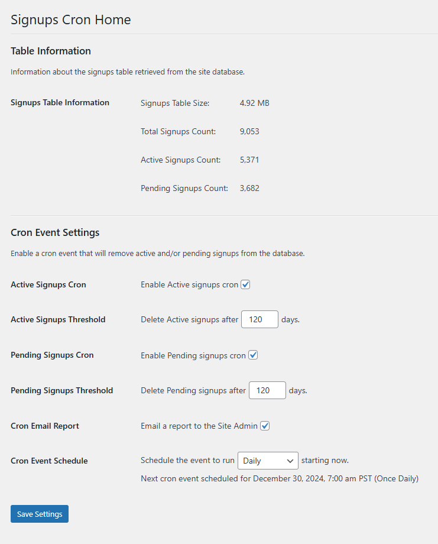

# WordPress Signups Cron

Manage WordPress signups via WP-Cron.

## Description

Enable a cron event that will remove active and/or pending signups from the database.

## Features

* Displays information about the signups table such as size and number of signups.
* Enable or disable removal of active and pending signups independently.
* Set separate thresholds for how old the signups should be before removal.
* Choose to email a report to the Site Admin.
* Set how often the cron event will run and see when the next event is scheduled for.

## Installation

This plugin can be installed the same as any other WordPress plugin. Options are as follows:

* Download the latest release and install via WordPress Admin.
* Clone the project, create a zip file of the signups-cron folder, and install via WordPress Admin.
* Clone the project and upload the signups-cron folder to /wp-content/plugins via ftp.

Once installation is complete, activate the plugin, then  go to Users > Signups Cron to change settings.

## Changelog

### 1.0.0

* Initial public release.

## License

WordPress Signups Cron is licensed under the GPL v2 or later.

> This program is free software; you can redistribute it and/or modify it under the terms of the GNU General Public License, version 2, as published by the Free Software Foundation.

> This program is distributed in the hope that it will be useful, but WITHOUT ANY WARRANTY; without even the implied warranty of MERCHANTABILITY or FITNESS FOR A PARTICULAR PURPOSE. See the GNU General Public License for more details.

> You should have received a copy of the GNU General Public License along with this program; if not, write to the Free Software Foundation, Inc., 51 Franklin St, Fifth Floor, Boston, MA 02110-1301 USA

A copy of the license is included in the root of the plugin’s directory. The file is named `LICENSE`.
